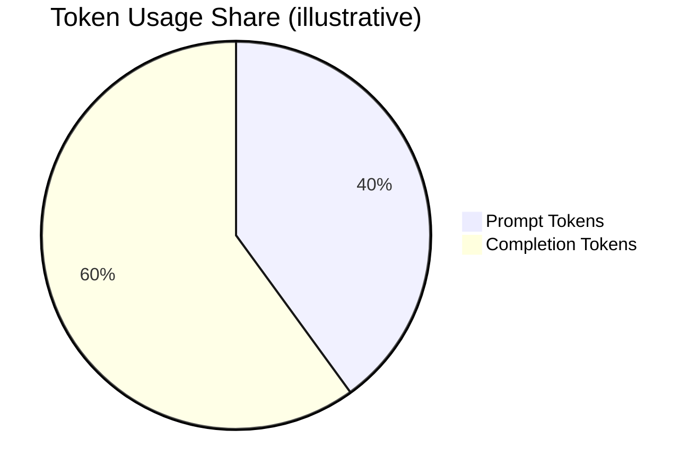
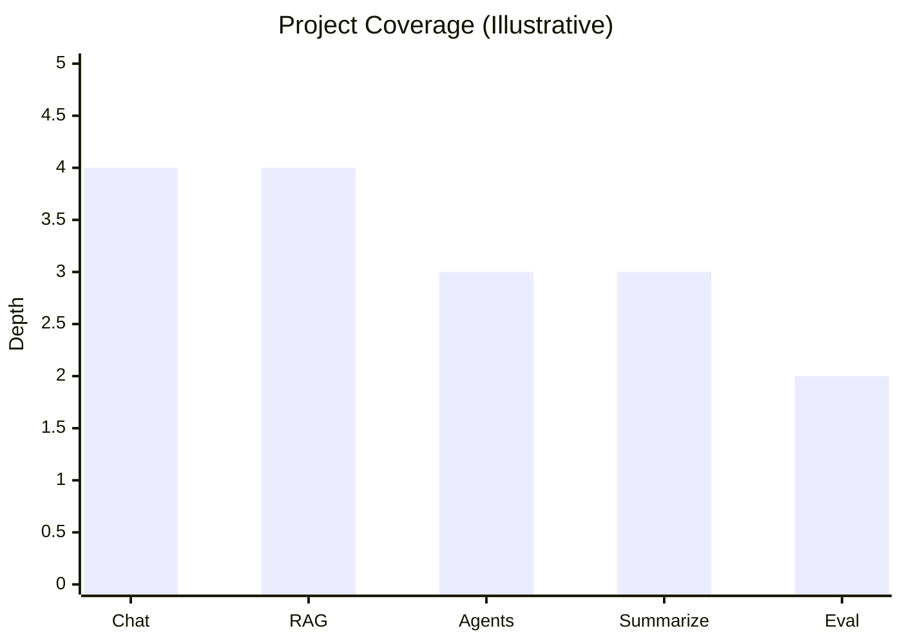

# LLM Engineering Projects 🚀

[](LICENSE)


A curated collection of **hands-on Large Language Model (LLM) projects** with clean notebooks, reproducible environments, and a production-minded folder structure. Perfect for showcasing real skills: retrieval (RAG), agentic workflows, multimodal I/O, prompt engineering, evaluation, and lightweight fine-tuning.

---

## ✨ Highlights

* 🧠 **Practical LLM apps**: chat, RAG, agents, audio/text summarization, code tools.
* 📦 **Reproducible** with `uv` (fast, deterministic installs).
* 🧹 **Clean Git history**: notebook outputs stripped on commit.
* 📁 **Professional structure** for easy navigation and cloning.
* 🧪 **Evaluation first**: basic eval hooks you can extend.
* 🛡️ **Secrets safe**: `.env` usage documented; nothing sensitive tracked.

---

## 🗺️ Table of Contents

* [Project Structure](#project-structure)
* [Quickstart](#quickstart)
* [Configuration](#configuration)
* [Usage](#usage)
* [Project Index](#project-index)
* [Evaluation & Logging](#evaluation--logging)
* [Development Workflow](#development-workflow)
* [Data & Privacy](#data--privacy)
* [Roadmap](#roadmap)
* [FAQ](#faq)
* [License](#license)

---

## Project Structure

```
.
├─ notebooks/                # Primary notebooks (work, demos, analysis)
│  ├─ week1/                 # Example grouping by theme/week
│  │  ├─ day1.ipynb
│  │  ├─ day2 EXERCISE.ipynb
│  │  ├─ Guide to Jupyter.ipynb
│  │  └─ Intermediate Python.ipynb
│  └─ ...                   
├─ src/                      # Reusable Python modules (utils, pipelines, loaders)
│  ├─ __init__.py
│  ├─ io_utils.py
│  ├─ rag_utils.py
│  └─ eval_utils.py
├─ reports/
│  └─ figures/               # Exported plots/images for docs
├─ data/                     # (ignored) raw/processed local data
│  ├─ raw/
│  └─ processed/
├─ .gitattributes            # nbstripout filter (keeps diffs small)
├─ .gitignore                # envs, checkpoints, data not tracked
├─ pyproject.toml            # `uv` project definition
├─ uv.lock                   # `uv` lockfile (pin exact deps)
└─ README.md                 # this file
```

> 🔒 `data/`, `.env`, `.ipynb_checkpoints/`, caches, and local DBs are **ignored** by Git for safety and cleanliness.

---

## Quickstart

### 1) Clone

```bash
git clone https://github.com/Parshav14/llm-engineering.git
cd llm-engineering
```

### 2) Sync environment with `uv` (Windows or macOS)

```bash
# Installs exact versions from uv.lock
uv sync
```

### 3) Launch JupyterLab

```bash
uv run jupyter lab
```

You’re ready. Open any notebook in `notebooks/` and run.

---

## Configuration

Create a `.env` file at the repo root if a notebook needs API keys (example):

```bash
# .env (example)
OPENAI_API_KEY=sk-****************
ANTHROPIC_API_KEY=***************
HF_TOKEN=hf_**********************
```

> 🔐 `.env` is **git-ignored** by default. Never commit secrets.

---

## Usage

### Running notebooks

* Use the **Launcher** in JupyterLab and open notebooks under `notebooks/`.
* Keep utilities in `src/` and import them in notebooks, e.g.:

  ```python
  from src.rag_utils import build_vector_index, query_index
  ```

### Adding dependencies

```bash
uv add langchain llama-index sentence-transformers pydantic tiktoken
git add pyproject.toml uv.lock
git commit -m "build: add LLM deps"
git push
```

### Optional power-ups

* **Cleaner diffs** for notebooks (pre-enabled here with `nbstripout`).
* **Jupytext pairing** (optional) for `.ipynb` ↔ `.py` side-by-side.
* **Nicer notebook diffs/merges** with `nbdime`.

---

## Evaluation & Logging

* Minimal utilities in `src/eval_utils.py` to record:

  * prompt, model, params, time, latency, token counts
  * exact input/outputs for reproducibility
* Extend with your preferred framework (e.g., `langsmith`, `wandb`, `weights & biases`) if needed.

### Example (Mermaid pie)



### Example (Mermaid bar)



> Replace with actual metrics/coverage as you build.

---

## Development Workflow

**Pull before you start**

```bash
git pull --rebase origin main
```

**Commit only what matters**

```bash
# Add just the notebooks or files you want to publish
git add notebooks/week1/day1.ipynb
git commit -m "feat: add tokenizer demo + eval hooks"
git push
```

**Keep history clean**

* Notebook outputs are stripped on commit via `.gitattributes` + `nbstripout`.
* Large files (datasets, local DBs) stay outside Git under `data/`.

**Windows line endings**

```bash
git config core.autocrlf true
```

---

## Data & Privacy

* Personal or licensed datasets should remain in `data/` (ignored by Git).
* Keep secrets in `.env` (ignored).
* When sharing notebooks publicly, sanitize sample data and redact sensitive info.

---

## Roadmap

* [ ] Add full RAG demo with embeddings + vector store
* [ ] Multimodal agent demo (text + audio + image)
* [ ] Lightweight QLoRA fine-tuning notebook
* [ ] Automated evaluation harness (precision, factuality, latency)
* [ ] Demo CI job to run smoke tests on notebooks

---

## FAQ

**Q: I see huge diffs on notebooks.**
A: Outputs are stripped on commit. If you still see noisy diffs, restart kernel, “Run All”, save, and commit again. Consider enabling Jupytext pairing for code-only reviews.

**Q: Someone else wants to run this.**
A: They only need:

```bash
git clone <repo>
cd <repo>
uv sync
uv run jupyter lab
```

…and any required keys in `.env`.

**Q: Where should I put helpers?**
A: Reusable code goes into `src/` and gets imported from notebooks. Keep notebooks focused on analysis and results.

---

## License

This repository is released under the **MIT License**. See `LICENSE` for details.

---

### Badges & Notes

* Shields.io badges above are informational; adjust to your taste.
* Mermaid diagrams render on GitHub automatically—no extra setup needed.

---

If you want, I can also generate a **starter `pyproject.toml`** (with `uv`) and **empty module stubs in `src/`** that match this README so it’s 100% plug-and-play.
